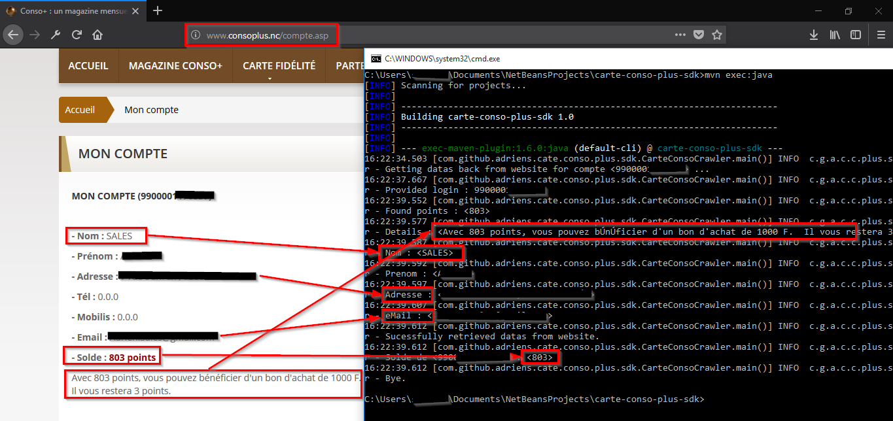

[](https://travis-ci.org/adriens/carte-conso-plus-sdk)
[](https://jitpack.io/#adriens/carte-conso-plus-sdk)


# carte-conso-plus-sdk
SDK java pour interagir avec le site (http://www.consoplus.nc/) de la Carte Conso + (Nouvelle-Calédonie).

# Demo



# Howto

Usage :

```java
public static void main(String[] args) {
        try {
            String login = "YOUR_LOGIN";
            String passwd = "YOUR_PASSWORD";
            CarteConsoCrawler wrap = new CarteConsoCrawler(login, passwd);
            logger.info(wrap.toString());
            logger.info("Bye.");
            System.exit(0);
        } catch (IOException ex) {
            ex.printStackTrace();
            System.exit(1);
        }
    }
```
